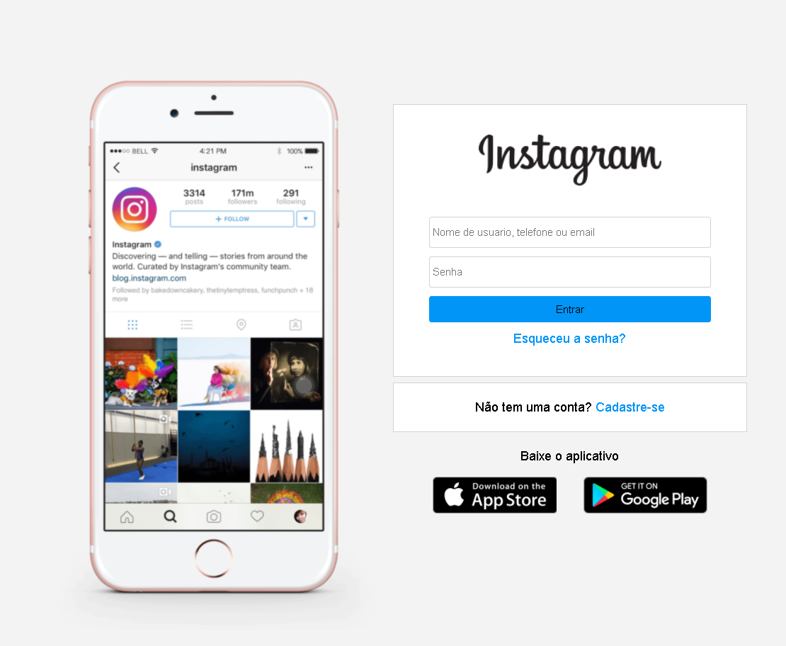

# Digital Innovation One - Instagram login page

## WELCOME! 👋

This is a project of the website **[Digital Innovation One](https://digitalinnovation.one/)**, that is a platform for free courses and bootcamps where you can learn about Web Technologies and they have a gamification system where they can refer you to companies/recruiters and they can see your score on the website. **[Gabriela Pinheiro](https://www.youtube.com/channel/UCgMbExqiFFPza79dyMsuugw)** is a volunteer instructor and Front-End Developer who, with the help of Digital Innovation One, published this project which is a copy of the Instagram login page using FlexBox, where I made some modifications and added other parts as a login page, logged in and of registration. Hope you like.

## The Challenge 🎯

This challenge is to reproduce the **Instagram Login Page** as close as possible to the original design.

My biggest challenge was using Flexbox, as it's the first time I' only used it on my sites. But I was able to understand how to use it and now making websites is even easier!!

## Technologies Used 🧩

* HTML5
* CSS3
* JavaScript
* FlexBox
* Media-queries
* Responsive Website

## Access My Resolution 💻

I hosted this challenge with the help of GitHub Pages, to access my resolution of this challenge [Click Here](https://samueloliveiraa.github.io/Recriando-pagina-inicial-do-instagram/)
